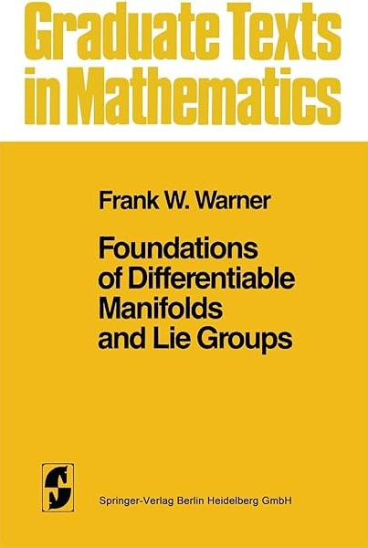

Howdy, I'm a PhD student in the mathematics department at UCSB. I study quantum topology and its connections to quantum computing and low dimensional topology. My research is supervised by Professor Zhenghan Wang.

In my free time, I enjoy running, gardening, and exploring new music and films. 

<nav class="quick-links" aria-label="Quick links">
  <a href="../../files/CV.pdf">CV PDF</a>
  <a href="mailto:ortegaray@math.ucsb.edu">Email</a>
  <a href="https://scholar.google.com/citations?user=cs1huCUAAAAJ&hl=en">Google Scholar</a>
  <a href="https://orcid.org/0009-0009-6516-3680">ORCID</a>
</nav>

<section class="gtm-aside" aria-labelledby="gtm-heading">
<figure class="gtm-cover">

</figure>

<h2 id="gtm-heading">Springer GTM</h2>

If I were a Springer-Verlag Graduate Text in Mathematics, I would be Frank Warner's <strong><em>Foundations of Differentiable Manifolds and Lie Groups</em></strong>.

I give a clear, detailed, and careful development of the basic facts on manifold theory and Lie Groups. I include differentiable manifolds, tensors and differentiable forms. Lie groups and homogenous spaces, integration on manifolds, and in addition provide a proof of the de Rham theorem via sheaf cohomology theory, and develop the local theory of elliptic operators culminating in a proof of the Hodge theorem. Those interested in any of the diverse areas of mathematics requiring the notion of a differentiable manifold will find me extremely useful.

Which Springer GTM would <em>you</em> be? <a href="http://math.jhu.edu/~savitt/GTM.html">The Springer GTM Test</a>

</section>
